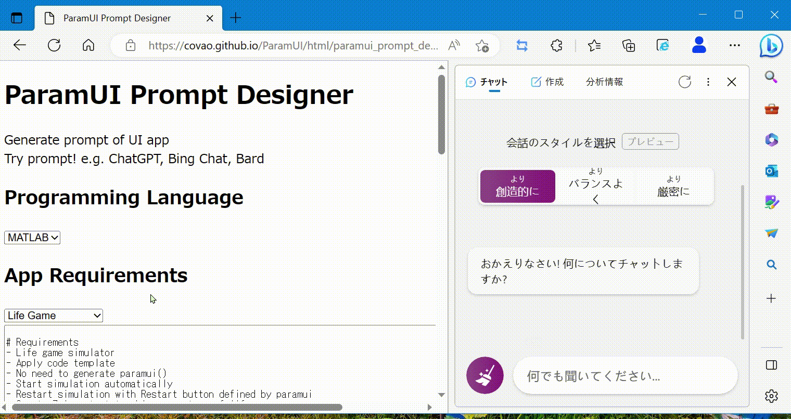
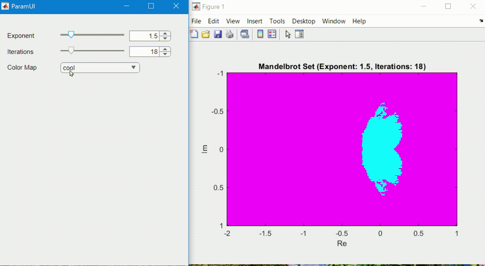
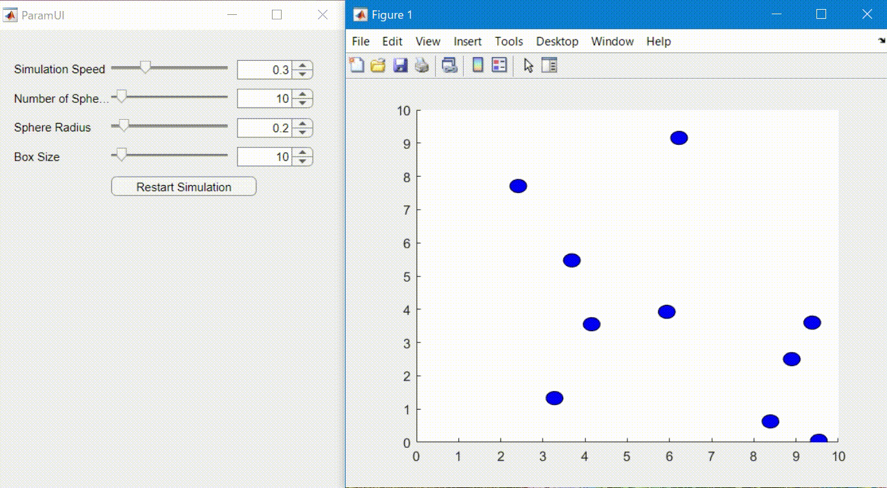

[Japanese(Google Translate)](https://github-com.translate.goog/covao/ParamUI_MATLAB?_x_tr_sl=en&_x_tr_tl=ja&_x_tr_hl=ja&_x_tr_pto=wapp)  
# ParamUI MATLAB
  
- Create App with UI from simple parameter table
- Easy code generation using ChatGPT

# MATLAB command to download and open the demo
~~~matlab
mkdir('./paramui_demo');
cd('./paramui_demo');
websave('paramui.m','https://github.com/covao/ParamUI_MATLAB/raw/main/paramui.m');
websave('hello_paramui.m','https://github.com/covao/ParamUI_MATLAB/raw/main/hello_paramui.m');
hello_paramui;
~~~
# Usage
## Parameter table definition
Parameter table is containing the following columns  
- Prameter Variable
- Parameter Label
- Initial Value
- Range 
  - Slider: [Min,Max,Step]
  - Check Box: []  
  - Edit Box: []  
  - Button: 'button'  
  - Selecter: {'A','B'}
  - FileName: '\*.txt;\*.doc'
  - Button: 'button'

~~~ matlab
% Hello ParamUI
ParameterTable = { 
    'A', 'Parameter A', 0.5, [0, 1, 0.1];
    'B', 'Parameter B', 150, [100, 500, 10];
    'F1', 'Flag 1', true, [];
    'F2', 'Flag 2', false, [];
    'S1', 'Select 1','Two',{'One','Two','Three'};
    'S2', 'Select 2','Three',{'One','Two','Three'};
    'Name1','Name 1','Taro', [];
    'Name2','Name 2','Jiro', [];
    'File1','File 1','', '*.m; *.asv';
    'Folder','Folder1','', 'folder';
    'Run', 'Run!', false, 'button';
 };
 
~~~

## Example 1: Run on UI Event
~~~ matlab
usrFunc = @(Prm) disp(Prm);
paramui(ParameterTable, usrFunc);

~~~

## Example 2: Loop & Get Parameters
~~~ matlab
pu = paramui(ParameterTable);
while(pu.IsAlive)
    disp(pu.Prm);
    pause(0.5);
end

~~~

# [ParamUI Prompt Designer](https://covao.github.io/ParamUI/html/paramui_prompt_designer.html?lang=MATLAB)
- Generate prompt of UI app using LLM
Try prompt! e.g. ChatGPT, Bing Chat, Bard  
 [Start ParamUI Prompt Designer](https://covao.github.io/ParamUI/html/paramui_prompt_designer.html?lang=MATLAB)
 

# Demo
- [Life Game](lifegame.m)

- [Mandelblot](mandelbrot.m)

- [Bouncing Spheres](bouncing_spheres.m)

# Related Sites
- [ParamUI Python](https://github.com/covao/ParamUI)
